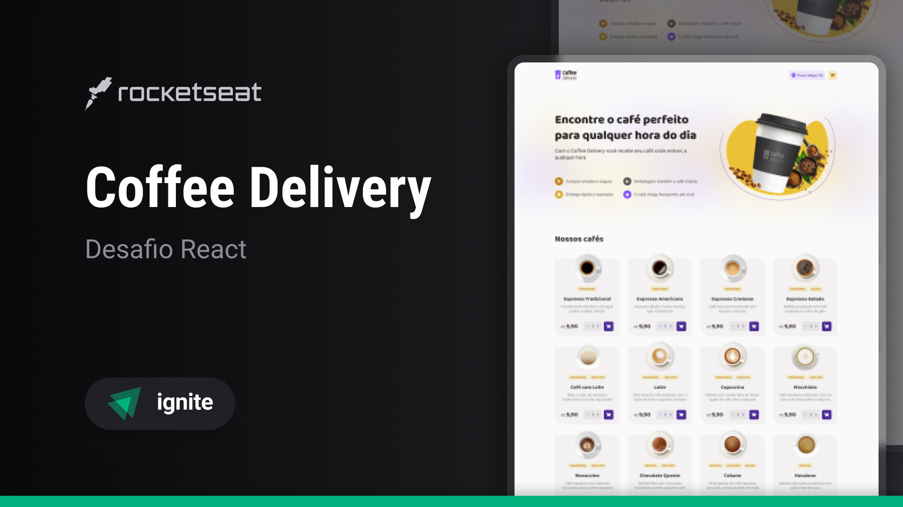
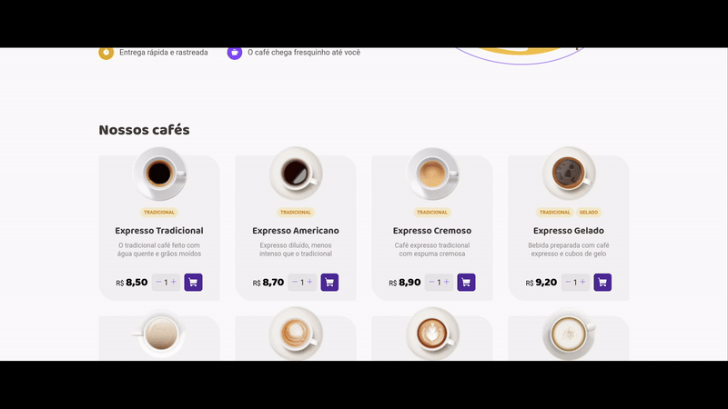
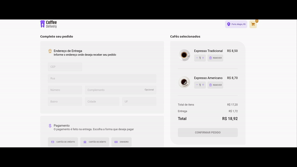
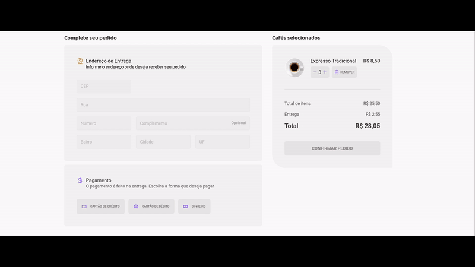
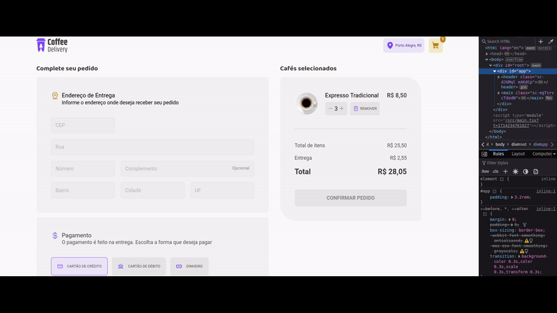
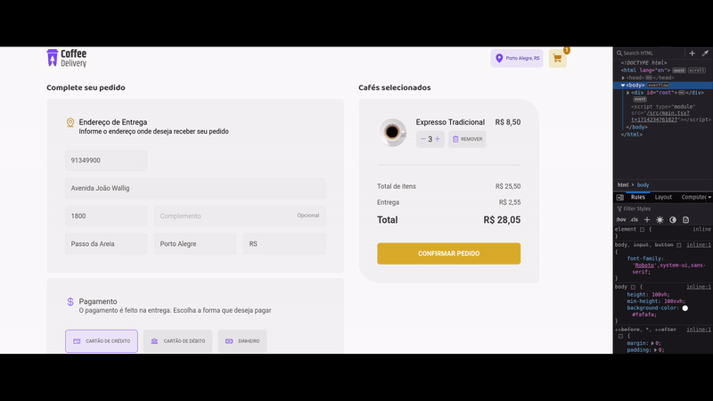
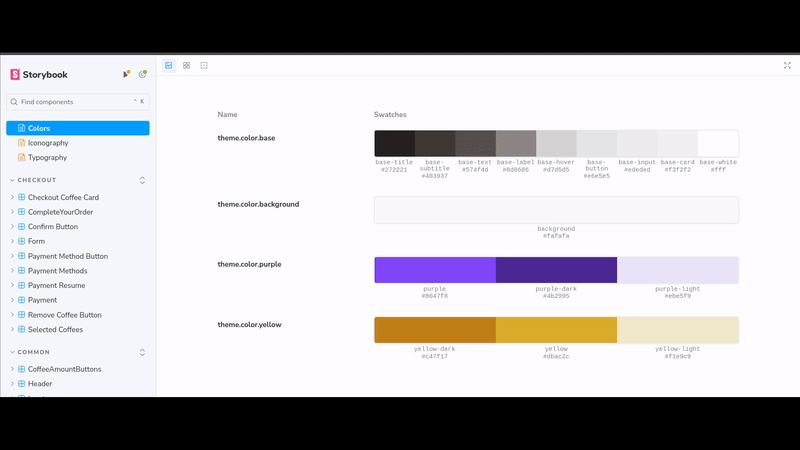
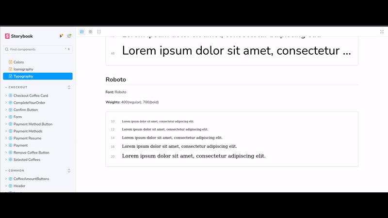
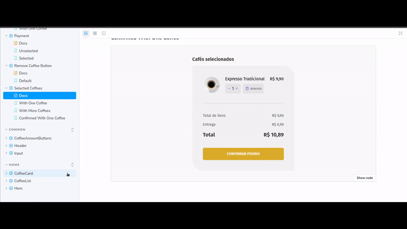
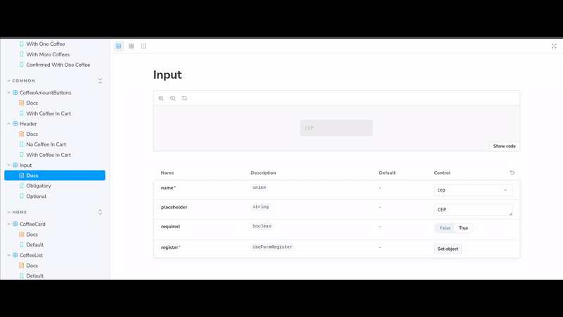

<h1 align='center'> Ignite Coffee Delivery </h1>

<div align='center'>

  
  
  [](https://opensource.org/licenses/MIT)

  [🎨 Design](https://www.figma.com/file/r5LZ0xLfw6eRVj2U7gpfmA/Coffee-Delivery-%E2%80%A2-Desafio-React-(Copy)?type=design&node-id=2-12&mode=design&t=zZhymDSG5ji1M0D6-0)

  [🇵🇹 Português](./docs/README-pt.md)

</div>

## 📚 Summary
- [❕ About](#about)
- [📖 Instructions](#instructions)
  - [📥 Install](#install)
  - [🚀 Run Locally](#locally)
  - [📋 Run Unit Tests](#unit-tests)
  - [📔 Run Storybook](#storybook)
- [📂 Structure](#structure)
- [🧰 Technologies](#technologies)
- [📸 Screenshots and 🎥 Recordings](#screenshots-prints)
- [👤 Author](#author)
- [📄 License](#license)

### <a id='about' style='text-decoration: none; color: inherit;'>❕ About</a>
This is my implementation of the challenge project "Coffee Delivery" from the second ReactJS module of [Ignite](https://www.rocketseat.com.br/ignite), an intermediate and advanced course in various programming languages and technologies offered by [Rocketseat](https://www.rocketseat.com.br/).

It implements the following functionalities, which will be demonstrated in photos and videos later on:
#### **Home screen**
- **Coffee listing:** Shows a coffee catalog to be added to the cart
- **Choose amount:** Subtracts or increments the amount of coffees to be added to the cart
#### **Checkout screen**
- **Change amount:** Subtracts or increments the amount of coffees in the cart
- **Remove coffees:** Remove coffees from the cart
- **Delivery address:** Informs the address to receive the delivery, informing the CEP, other fields are automatically fulfilled, like street, neighborhood, city and state
- **Payment methods:** Choose what payment will be used for the delivery, between the options of credit card, debit card and cash
#### **Conclusion screen**
- **Delivery confirmation:** Shows a resume of where it will be delivered, the payment method and the time estimative

### <a id='instructions' style='text-decoration: none; color: inherit;'>📖 Instructions</a>
#### <a id='instalar' style='text-decoration: none; color: inherit;'>📥 Install</a>
Paste the 1º command into a terminal opened within a folder of your preference to clone the project
```sh
git clone https://github.com/mar-alv/ignite-coffee-delivery.git
```

Then run one of the versions of the 2º command to install the dependencies
```sh
npm i
```
```sh
npm install
```

#### <a id='locally' style='text-decoration: none; color: inherit;'>🚀 Run Locally</a>
Paste the command into a terminal, the application will be accessable through this [link](http://localhost:5173)
```sh
npm run dev
```

#### <a id='unit-tests' style='text-decoration: none; color: inherit;'>📋 Run Unit Tests</a>
Paste the command into a terminal, they will be exectued one after the other mentioning if there were failed tests
```sh
npm run tests
```

#### <a id='storybook' style='text-decoration: none; color: inherit;'>📔 Run Storybook</a>
Paste the command into a terminal, the project's components documentation will be accessible through this [link](http://localhost:6006)
```sh
npm run storybook
```

### <a id='structure' style='text-decoration: none; color: inherit;'>📂 Structure</a>
```
│ .github/
│   └── ...
│ .storybook/
│   └── ...
│ .tests/
│   └── ...
│ docs/
│   └── ...
│ src/
│   ├── assets/
│   │     └── ...
│   ├── components/
│   │     ├── context x/
│   │     │     ├── component y/
│   │     │     │     └── ...
│   │     │     └── ...
│   │     └── ...
│   ├── contexts/
│   │     └── ...
│   ├── enums/
│   │     └── ...
│   ├── interfaces/
│   │     └── ...
│   ├── pages/
│   │     ├── page x/
│   │     │     ├── component y/
│   │     │     │     └── ...
│   │     └──   └── ...
│   ├── styles/
│   │     └── ...
│   ├── utils/
│   │     └── ...
│   └── ...
│ stories/
│   ├── components/
│   │     ├── context x/
│   │     │     └── ...
│   │     └── ...
│   └── ...
│ tests/
│   ├── contexto x/
│   |		  └── ...
│   └── ...
```

### <a id='technologies' style='text-decoration: none; color: inherit;'>🧰 Technologies</a>
#### Build Tools
[](https://vitejs.dev/)

#### Documentation
[](https://storybook.js.org/)

#### Front-end Framework
[](https://reactjs.org/)
[](https://reactrouter.com/en/main)
[](https://www.typescriptlang.org/)

#### Styling
[](https://phosphoricons.com/)
[](https://styled-components.com/)

#### Utilities
[](https://react-hook-form.com/)

#### Testing
[](https://testing-library.com/docs/react-testing-library/intro)
[](https://jestjs.io/)

### <a id='screenshots-prints' style='text-decoration: none; color: inherit;'>📸 Screenshots and 🎥 Recordings</a>
For a longer video demonstration click here and like my post on <a href='https://www.linkedin.com/posts/marcelo-dos-santos-alvarez-474406180_my-code-solution-for-coffee-delivery-a-challenge-activity-7078453723521253376-7vWp/'>LinkedIn</a>

<div align='center'>

  
  Home screen

</div>

<div align='center'>

  
  Adding coffee

</div>

<div align='center'>

  
  Removing coffee

</div>

<div align='center'>

  
  Choosing payment method

</div>

<div align='center'>

  
  Filling delivery address

</div>

<div align='center'>

  
  Confirming delivery

</div>

<div align='center'>

  
  Generic stories

</div>

<div align='center'>

  
  Checkout stories

</div>

<div align='center'>

  
  Common stories

</div>

<div align='center'>

  
  Home stories

</div>

### <a id='author' style='text-decoration: none; color: inherit;'>👤 Author</a>
<div style='display: flex; align-items: center;'>
		
		<div>
				<strong>Marcelo Alvarez</strong>
				<br>
				<em>Front-end Developer</em><br>
				<span>"Some AI generated funny quote here 😗"</span><br>
				<a href='https://www.linkedin.com/in/mar-alv'>
					
				</a>
				<a href='https://mar-alv.github.io/'>
					
				</a>
		</div>
</div>

### <a id='license' style='text-decoration: none; color: inherit;'>📄 License</a>
Licensed under [MIT](./LICENSE)
